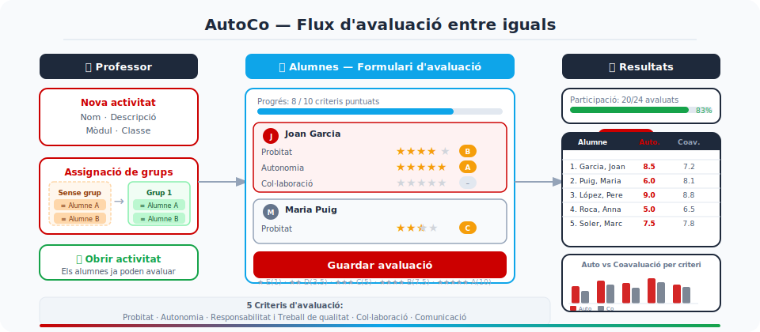

# AutoCo — Sistema d'Avaluació entre Iguals

Aplicació web per gestionar **autoavaluació** i **coavaluació** d'alumnes en activitats de grup, pensada per a entorns educatius de cicles formatius i batxillerat.



---

## Funcionalitats

### Professor / Administrador
- Gestió de **classes**, **alumnes** i **mòduls** (UF/MP), amb edició inline
- Creació d'**activitats** d'avaluació per mòdul, amb obertura i tancament manual des del tauler
- Configuració de **grups** per **arrossegar i deixar anar** (drag & drop): alumnes sense grup a l'esquerra, grups en 3 columnes a la dreta
- Importació/exportació de grups per CSV
- **Duplicació d'activitats** reutilitzant la configuració de grups i membres
- Consulta de **resultats** amb taula detallada per alumne: puntuació per criteri (Autoaval. / Coaval.), nota global i barra de progrés de participació
- **Gràfiques comparatives** per grup (auto vs. co-avaluació, desglossament per criteri)
- **Exportació CSV** de resultats
- **Còpies de seguretat** del servidor: exportació/importació JSON de tota la base de dades
- Enviament de **credencials per correu** als alumnes (SMTP configurable)
- Gestió de **professors** i permisos d'administrador (exclusiu rol Admin)
- **Exclusions per mòdul**: alumnes que no participen en un mòdul concret

### Alumne
- Accés amb correu electrònic i contrasenya
- Avaluació de tots els membres del grup (inclosa autoavaluació) per 5 criteris
- Puntuació amb **escala de 5 estrelles** mostrada com a lletra (E / D / C / B / A)
- **Barra de progrés** d'avaluació completada en temps real (X/Y criteris puntuats)
- Filtre d'activitats pendents al dashboard

### Criteris d'avaluació (fixes per a totes les activitats)

| Clau | Descripció |
|------|------------|
| `probitat` | Probitat |
| `autonomia` | Autonomia |
| `responsabilitat` | Responsabilitat i Treball de qualitat |
| `collaboracio` | Col·laboració i treball en equip |
| `comunicacio` | Comunicació |

### Escala de puntuació

| Estrelles | Lletra | Valor numèric |
|:---------:|:------:|:-------------:|
| ★☆☆☆☆ | E | 1 |
| ★★☆☆☆ | D | 3.5 |
| ★★★☆☆ | C | 5 |
| ★★★★☆ | B | 7.5 |
| ★★★★★ | A | 10 |

---

## Arquitectura

```
AutoCo/
├── api/          # API REST — ASP.NET Core 9 Minimal API
│   ├── Data/     # EF Core DbContext, models i seed
│   ├── Services/ # Lògica de negoci
│   ├── Migrations/
│   └── Dockerfile
├── web/          # Frontend — Blazor Server + MudBlazor
│   ├── Components/
│   │   ├── Pages/   # Alumne/, Professor/, Admin/, Auth/
│   │   ├── Shared/  # Diàlegs i components reutilitzables
│   │   └── Layout/
│   ├── Services/    # ApiClient, UserStateService
│   ├── wwwroot/
│   │   ├── css/site.css   # Estils globals + DnD
│   │   └── js/app.js      # Utilitats JS (download, dragover síncron)
│   └── Dockerfile
├── shared/       # DTOs compartits entre api i web
├── nginx/        # Proxy invers amb SSL automàtic
├── deploy/       # Script de generació del paquet de desplegament
└── docker-compose.yml
```

### Serveis Docker

| Servei | Imatge | Port | Descripció |
|--------|--------|------|------------|
| `db` | SQL Server 2022 Express | intern | Base de dades principal |
| `redis` | Redis 7 Alpine | intern | Caché de resultats + backplane SignalR |
| `api` | ASP.NET Core 9 | intern | API REST + JWT |
| `web` | ASP.NET Core 9 | intern | Blazor Server + MudBlazor |
| `nginx` | nginx Alpine | 80 / 443 | Proxy SSL, WebSocket per Blazor |

### Model de dades

```
Professor ──< Module ──< Activity ──< Group ──< GroupMember (Student)
              │                            └──< Evaluation (Evaluator→Evaluated)
              │                                        └──< EvaluationScore (per criteri)
Class ────────┘
  └──< Student
  └──< ModuleExclusion (alumnes exclosos d'un mòdul)
```

- Un `Module` pertany a una `Class` i a un `Professor`
- Una `Activity` pertany a un `Module`
- Un alumne avalua tots els membres del seu grup (inclòs ell mateix — `IsSelf = true`)

---

## Tecnologies

- **Backend:** C# / ASP.NET Core 9 · Entity Framework Core · SQL Server 2022
- **Frontend:** Blazor Server · [MudBlazor](https://mudblazor.com/)
- **Autenticació:** JWT (professors) · email + contrasenya (alumnes) · `ProtectedLocalStorage` per a persistència de sessió (resisteix F5 sense perdre sessió)
- **Caché:** Redis (`IDistributedCache`, TTL 5 min, invalidació automàtica en modificar grups)
- **Seguretat:** BCrypt (work factor 12) · JWT secret mínim 32 caràcters · validació de valors de puntuació al backend
- **Email:** SMTP configurable (Gmail, etc.) per enviar credencials
- **Desplegament:** Docker Compose · nginx (SSL/TLS auto-signat o certificat propi)

---

## Rols

| Rol | Accés |
|-----|-------|
| **Admin** | Tot. Gestiona professors, veu totes les classes i activitats, còpies de seguretat |
| **Professor** | Les seves pròpies classes, mòduls, activitats i resultats |
| **Alumne** | Les activitats del seu grup. Pot avaluar mentre l'activitat és oberta |

---

## Desplegament

### Opció A — Entorn local (desenvolupament)

**Requisits:** Docker Desktop

```bash
git clone https://github.com/JosepTomasComellas/AutoCo.git
cd AutoCo
cp .env.example .env        # edita les variables si cal
docker compose up --build
```

Accedeix a **https://localhost** (accepta l'avís del certificat auto-signat).

### Opció B — Servidor Linux (producció)

**Requisits:** Windows amb PowerShell + accés SSH al servidor Linux amb Docker Engine >= 24.

**1. Generar el paquet de desplegament** (Windows):

```powershell
# Des del directori arrel del projecte
.\deploy\generar-deploy.ps1

# O amb ruta personalitzada
.\deploy\generar-deploy.ps1 -Dest "C:\Users\usuari\Desktop\autoco-deploy"
```

Genera un directori `autoco-deploy-YYYYMMDD` amb tot el codi i els scripts d'instal·lació.

El script preserva automàticament:
- El fitxer `.env` si ja existeix al destí o al directori arrel del projecte
- Els certificats SSL (`nginx/ssl/server.crt` i `server.key`) si ja existeixen al directori de destí

**2. Copiar al servidor:**

```bash
scp -r autoco-deploy-YYYYMMDD usuari@servidor:/opt/autoco
```

**3. Editar les variables d'entorn al servidor:**

```bash
nano /opt/autoco/.env
```

**4. Instal·lar:**

```bash
sudo bash /opt/autoco/install.sh
```

`install.sh` valida les variables crítiques, construeix les imatges i arrenca tots els contenidors.

### Comandes útils

```bash
docker compose up           # Aixecar sense reconstruir
docker compose up --build   # Reconstruir i aixecar
docker compose down         # Aturar (dades preservades)
docker compose down -v      # Aturar i esborrar totes les dades
docker compose logs -f      # Logs en temps real
bash /opt/autoco/update.sh  # Actualitzar (reconstrueix imatges)
bash /opt/autoco/backup.sh  # Backup manual de la BD
```

---

## Configuració (.env)

Copia `.env.example` a `.env` i ajusta els valors:

| Variable | Descripció | Obligatori |
|----------|------------|:----------:|
| `MSSQL_SA_PASSWORD` | Contrasenya SQL Server (mínim 8 car., majúsc., número i símbol) | ✓ |
| `JWT_SECRET` | Secret JWT (mínim 32 caràcters) | ✓ |
| `JWT_EXPIRY_HOURS` | Durada del token en hores (per defecte: 8) | |
| `ADMIN_EMAIL` | Correu de l'administrador inicial | ✓ |
| `ADMIN_PASSWORD` | Contrasenya de l'administrador inicial | ✓ |
| `ADMIN_NOM` | Nom de l'administrador | ✓ |
| `ADMIN_COGNOMS` | Cognoms de l'administrador | ✓ |
| `SMTP_HOST` | Servidor SMTP (p.ex. `smtp.gmail.com`) | |
| `SMTP_PORT` | Port SMTP (p.ex. `587`) | |
| `SMTP_USERNAME` | Usuari SMTP | |
| `SMTP_PASSWORD` | Contrasenya SMTP (o app password) | |
| `SMTP_FROM_ADDRESS` | Adreça remitent dels correus | |
| `SMTP_FROM_NAME` | Nom remitent dels correus | |
| `APP_WEB_URL` | URL pública de l'aplicació (p.ex. `https://autoco.centre.cat`) | |

> El SMTP és opcional. Si no es configura, les funcions d'enviament de credencials per correu quedaran desactivades però la resta de l'aplicació funciona amb normalitat.

### SSL

- **Sense certificat:** nginx genera automàticament un certificat auto-signat vàlid 10 anys.
- **Amb certificat propi:** col·loca `server.crt` i `server.key` al directori `nginx/ssl/` abans d'arrencar.

---

## Endpoints principals de l'API

```
POST /api/auth/professor                              # Login professor/admin
POST /api/auth/student                                # Login alumne

GET/POST/PUT/DELETE /api/professors                   # Gestió professors (admin)
GET/POST/PUT/DELETE /api/classes                      # Gestió classes
GET/POST/PUT/DELETE /api/classes/{id}/students        # Gestió alumnes
POST /api/classes/{id}/students/bulk                  # Importació massiva CSV
POST /api/classes/{id}/students/{sid}/reset-password  # Reset contrasenya
POST /api/classes/{id}/students/{sid}/send-password   # Enviar credencials per correu
POST /api/classes/{id}/students/send-all-passwords    # Enviar credencials a tots
GET/POST/PUT/DELETE /api/classes/{id}/modules         # Gestió mòduls
GET/POST/DELETE    /api/modules/{id}/exclusions       # Exclusions per mòdul

GET/POST/PUT/DELETE /api/activities                   # Gestió activitats
POST /api/activities/{id}/toggle                      # Obrir/tancar activitat
POST /api/activities/{id}/duplicate                   # Duplicar activitat
GET  /api/activities/{id}/groups/export               # Exportar grups (CSV)
POST /api/activities/{id}/groups/import               # Importar grups (CSV)
GET/POST/DELETE /api/activities/{id}/groups           # Gestió grups
POST/DELETE /api/activities/{id}/groups/{gid}/members # Membres de grup

GET  /api/evaluations/{activityId}                    # Formulari d'avaluació (alumne)
POST /api/evaluations/{activityId}                    # Guardar avaluació
GET  /api/student/activities                          # Dashboard alumne

GET  /api/results/{activityId}                        # Resultats (professor)
GET  /api/results/{activityId}/chart                  # Dades gràfica
GET  /api/results/{activityId}/csv                    # Exportar CSV

GET  /api/admin/backup/export                         # Exportar backup JSON
POST /api/admin/backup/import                         # Importar backup JSON
GET/POST /api/admin/backup/files                      # Backups al servidor
GET/DELETE /api/admin/backup/files/{name}             # Descarregar/eliminar backup
POST /api/admin/backup/files/{name}/restore           # Restaurar backup del servidor

GET  /api/health                                      # Estat DB + Redis
GET  /api/criteria                                    # Llista de criteris
```

---

## Llicència

Projecte de codi obert per a ús educatiu — Salesians de Sarrià, Departament d'Informàtica.
