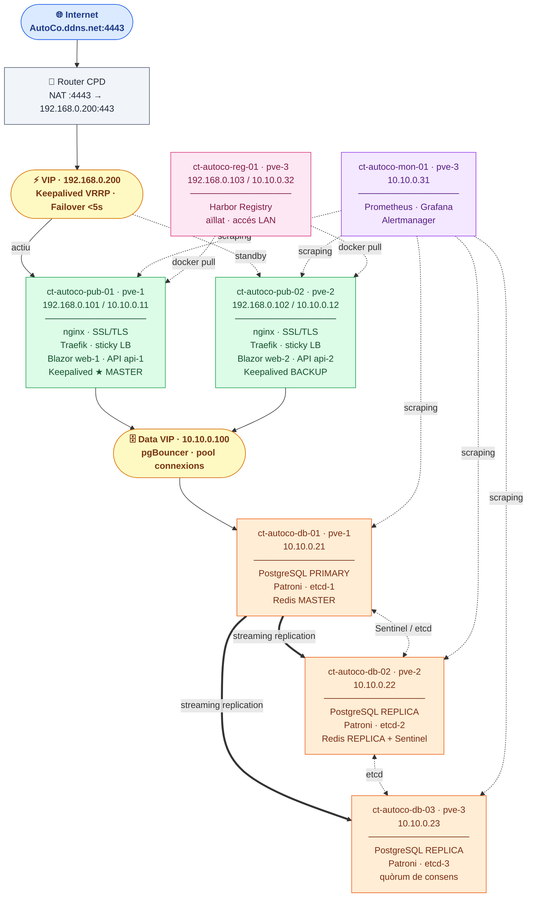
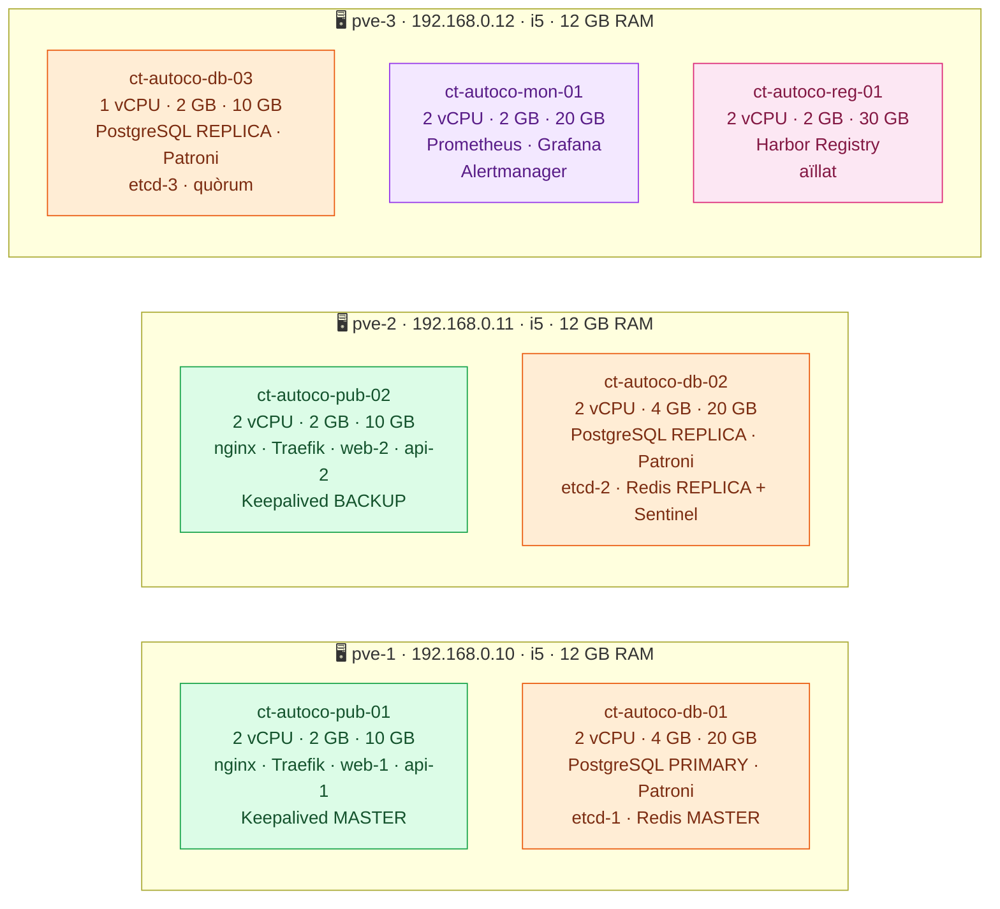

# AutoCo — Pla d'Infraestructura Alta Disponibilitat

> **Versió 1.0 · Maig 2026**  
> Desplegament en entorn Proxmox LXC · Harbor · PostgreSQL HA · Monitorització  
> URL pública: `https://AutoCo.ddns.net:4443`  
> Maquinari: 3 nodes Proxmox · Intel i5 · 12 GB RAM cadascun

---

## 1. Resum executiu

La solució desplega AutoCo en tres capes independents sobre contenidors LXC Ubuntu Server 24.04 en un clúster Proxmox de 3 nodes.

| Capa | Descripció | HA |
|---|---|---|
| **1 · Publicació** | nginx + Traefik + Blazor web + ASP.NET API | Actiu/passiu · Keepalived VRRP · failover <5 s |
| **2 · Dades** | PostgreSQL + Patroni + etcd + Redis | Clúster 3 nodes · failover automàtic <30 s |
| **3 · Monitor/Registry** | Prometheus + Grafana + Harbor | Node dedicat pve-3 |

**Restricció de xarxa:** 6 IPs a `192.168.0.0/24` (3 nodes + 2 pub + 1 VIP). Tota la comunicació interna usa `10.10.0.0/24`.

---

## 2. Diagrama lògic



---

## 3. Diagrama de distribució física



> **Tolerància a fallades:** si cau pve-1 → pub-02 agafa la VIP + db-02 és promogut a primari. Si cau pve-2 → pve-1 té la VIP + db-01 segueix com a primari. Si cau pve-3 → el servei als alumnes no s'afecta.

---

## 4. Taula d'adreçament IP

### 4.1 Xarxa externa — 192.168.0.0/24 (LAN escolar)

| Hostname / Rol | IP | Tipus |
|---|---|---|
| Router / Gateway | `192.168.0.1` | Gateway |
| pve-1 (Proxmox node 1) | `192.168.0.10` | Node Proxmox |
| pve-2 (Proxmox node 2) | `192.168.0.11` | Node Proxmox |
| pve-3 (Proxmox node 3) | `192.168.0.12` | Node Proxmox |
| ct-autoco-pub-01 (eth0) | `192.168.0.101` | LXC · VRRP |
| ct-autoco-pub-02 (eth0) | `192.168.0.102` | LXC · VRRP |
| ct-autoco-reg-01 (eth0) | `192.168.0.103` | LXC · Harbor push LAN |
| **VIP Publicació** | **`192.168.0.200`** | **Keepalived · entrada servei** |

### 4.2 Xarxa interna — 10.10.0.0/24 (inter-contenidors)

| Hostname | IP interna | Capa | Serveis |
|---|---|---|---|
| ct-autoco-pub-01 (eth1) | `10.10.0.11` | Publicació | nginx, Traefik, web-1, api-1 |
| ct-autoco-pub-02 (eth1) | `10.10.0.12` | Publicació | nginx, Traefik, web-2, api-2 |
| **Data VIP (pgBouncer)** | **`10.10.0.100`** | **VIP** | **Proxy entrada capa de dades** |
| ct-autoco-db-01 | `10.10.0.21` | Dades | PostgreSQL, Patroni, etcd-1, Redis |
| ct-autoco-db-02 | `10.10.0.22` | Dades | PostgreSQL, Patroni, etcd-2, Redis |
| ct-autoco-db-03 | `10.10.0.23` | Dades | PostgreSQL, Patroni, etcd-3 |
| ct-autoco-mon-01 | `10.10.0.31` | Monitor | Prometheus, Grafana, Alertmanager |
| ct-autoco-reg-01 (eth1) | `10.10.0.32` | Registry | Harbor (accés intern dels nodes pub) |

### 4.3 NAT al router

| Port extern | Destí intern | Propòsit |
|---|---|---|
| `TCP 4443` | `192.168.0.200:443` | AutoCo HTTPS |
| `TCP 80` | `192.168.0.200:80` | Let's Encrypt ACME |

---

## 5. Especificació dels contenidors LXC

> Sistema operatiu: **Ubuntu Server 24.04 LTS** · Tots amb Docker Engine instal·lat

| Contenidor | Node | vCPU | RAM | Disc | eth0 | eth1 |
|---|---|---|---|---|---|---|
| `ct-autoco-pub-01` | pve-1 | 2 | 2 GB | 10 GB | `192.168.0.101/24` | `10.10.0.11/24` |
| `ct-autoco-pub-02` | pve-2 | 2 | 2 GB | 10 GB | `192.168.0.102/24` | `10.10.0.12/24` |
| `ct-autoco-db-01` | pve-1 | 2 | 4 GB | 20 GB | — | `10.10.0.21/24` |
| `ct-autoco-db-02` | pve-2 | 2 | 4 GB | 20 GB | — | `10.10.0.22/24` |
| `ct-autoco-db-03` | pve-3 | 1 | 2 GB | 10 GB | — | `10.10.0.23/24` |
| `ct-autoco-mon-01` | pve-3 | 2 | 2 GB | 20 GB | — | `10.10.0.31/24` |
| `ct-autoco-reg-01` | pve-3 | 2 | 2 GB | 30 GB | `192.168.0.103/24` | `10.10.0.32/24` |

**Consum per node:** ~7.5 GB (6 GB LXC + 1.5 GB Proxmox OS) → **4.5 GB lliures** de marge per absorir fallades.

---

## 6. Disseny de xarxes Proxmox

### Bridges Linux (per a cada node)

| Bridge | Xarxa | Propòsit |
|---|---|---|
| `vmbr0` | `192.168.0.0/24` | Extern · uplink al switch físic |
| `vmbr1` | `10.10.0.0/24` | Intern · sense uplink (local o VLAN) |

### `/etc/network/interfaces` (exemple pve-1)

```
auto lo
iface lo inet loopback

auto enp3s0
iface enp3s0 inet manual

auto vmbr0
iface vmbr0 inet static
    address 192.168.0.10/24
    gateway 192.168.0.1
    bridge-ports enp3s0
    bridge-stp off
    bridge-fd 0

auto vmbr1
iface vmbr1 inet static
    address 10.10.0.254/24
    bridge-ports none
    bridge-stp off
    bridge-fd 0
```

### Extensió inter-node (fase producció)

| Opció | Requisit | Mètode |
|---|---|---|
| VLANs 802.1Q | Switch gestionat | Trunk VLAN al switch, vmbr0 VLAN-aware |
| 2a NIC dedicada | 2a targeta física | vmbr1 amb uplink a xarxa aïllada |
| WireGuard overlay | Software (provisional) | Túnel xifrat entre nodes sobre vmbr0 |

---

## 7. Pla d'acció fase a fase

### Fase 0 — Preparació clúster Proxmox
**Temps:** 2-3 h · **Downtime:** cap

1. Crear el clúster: `pvecm create autoco-cluster` (des de pve-1)
2. Afegir pve-2: `pvecm add 192.168.0.10` (des de pve-2)
3. Afegir pve-3: `pvecm add 192.168.0.10` (des de pve-3)
4. Verificar: `pvecm status` → 3 nodes, Quorum OK
5. Configurar `vmbr0` i `vmbr1` als 3 nodes
6. Descarregar plantilla: `pveam download local ubuntu-24.04-standard_*.tar.zst`

---

### Fase 1 — Creació dels LXC base
**Temps:** 1-2 h · **Downtime:** cap

```bash
# Exemple per a ct-autoco-pub-01 (VMID 101, a pve-1)
pct create 101 local:vztmpl/ubuntu-24.04-standard_*.tar.zst \
  --hostname ct-autoco-pub-01 \
  --cores 2 --memory 2048 --swap 512 \
  --rootfs local-lvm:10 \
  --net0 name=eth0,bridge=vmbr0,ip=192.168.0.101/24,gw=192.168.0.1 \
  --net1 name=eth1,bridge=vmbr1,ip=10.10.0.11/24 \
  --features nesting=1,fuse=1 \
  --unprivileged 0 \
  --start 1
```

1. Crear els 7 contenidors (veure taula secció 5)
2. Instal·lar Docker: `curl -fsSL https://get.docker.com | sh`
3. Instal·lar `docker compose`, `curl`, `htop`
4. Configurar SSH amb clau pública des de la màquina de gestió
5. Verificar connectivitat interna: `ping 10.10.0.21` des de pub-01

> **Nota Docker en LXC:** afegir a `/etc/pve/lxc/<vmid>.conf`: `lxc.apparmor.profile: unconfined`

---

### Fase 2 — Capa de dades
**Temps:** 3-4 h · **Downtime:** cap (nova infraestructura)

1. Desplegar clúster **etcd** als 3 nodes db (ports 2379/2380)
2. Verificar quòrum: `etcdctl endpoint health --endpoints=10.10.0.21:2379,10.10.0.22:2379,10.10.0.23:2379`
3. Desplegar **Patroni** + PostgreSQL 16 als 3 nodes
4. Verificar: `patronictl list` → 1 Leader + 2 Replica
5. Desplegar **Redis** master (db-01) + replica (db-02) + Sentinel
6. Desplegar **pgBouncer** a db-01/db-02 com a proxy al primari
7. Configurar **Keepalived** per al Data VIP `10.10.0.100`

**Verificació:** aturar patroni a db-01 → db-02 ha de ser promogut a primari en <30 s automàticament.

---

### Fase 3 — Capa de publicació
**Temps:** 2-3 h · **Downtime:** cap

1. Desplegar **Traefik v3** amb sticky sessions a pub-01 i pub-02
2. Desplegar **nginx** (SSL termination) per davant de Traefik
3. Desplegar contenidors de l'app (o test inicial)
4. Configurar **Keepalived** (MASTER pub-01, BACKUP pub-02) per al VIP `192.168.0.200`

```
# Keepalived pub-01 (MASTER)
vrrp_instance VI_PUB {
    state MASTER
    interface eth0
    virtual_router_id 51
    priority 110
    advert_int 1
    authentication { auth_type PASS; auth_pass autoco2026 }
    virtual_ipaddress { 192.168.0.200/24 }
}
```

**Verificació:** `systemctl stop keepalived` a pub-01 → VIP apareix a pub-02 en <5 s.

---

### Fase 4 — Harbor Registry
**Temps:** 1-2 h · **Downtime:** cap

1. Descarregar instal·lador: `wget https://github.com/goharbor/harbor/releases/latest/download/harbor-offline-installer.tgz`
2. Configurar `harbor.yml`: hostname `192.168.0.103`, SSL auto-signat
3. Executar `./install.sh`
4. Accedir a `https://192.168.0.103` i crear projecte privat **autoco**
5. Test: `docker login 192.168.0.103` i push d'imatge de prova
6. Als nodes pub: `docker pull 192.168.0.103/autoco/web:latest`

> **Certificat Harbor:** afegir a cada node que faci push/pull: `/etc/docker/certs.d/192.168.0.103/ca.crt`

---

### Fase 5 — Monitorització
**Temps:** 2-3 h · **Downtime:** cap

1. Desplegar **Prometheus** amb scraping: Traefik, node-exporter, postgres-exporter, redis-exporter
2. Desplegar **Grafana** amb dashboards importats (Traefik: 17346, PostgreSQL: 9628, Redis: 763)
3. Desplegar **Alertmanager** amb rutes cap a correu electrònic
4. Instal·lar `node-exporter` (port 9100) a cada LXC

| Alerta | Condició | Severitat |
|---|---|---|
| VIP no accessible | HTTPS 192.168.0.200 falla >30 s | Crítica |
| Failover PostgreSQL | Canvi de primari detectat | Alta |
| Node sense resposta | node-exporter mort >60 s | Alta |
| Disc >85% | Qualsevol volum | Mitja |
| RAM >90% durant >5 min | Qualsevol node | Mitja |

---

### Fase 6 — Accés exterior
**Temps:** 1 h · **Downtime:** ~2 min (canvi SSL)

1. Router: NAT `TCP 4443` → `192.168.0.200:443`
2. Router: NAT `TCP 80` → `192.168.0.200:80` (ACME challenge)
3. Configurar client DDNS per actualitzar `AutoCo.ddns.net`
4. Activar Let's Encrypt a Traefik (HTTP-01 challenge)
5. Actualitzar `APP_WEB_URL=https://AutoCo.ddns.net:4443`

---

### Fase 7 — Migració AutoCo (branca ha-proxmox)
**Temps:** 4-6 h · **Downtime:** ~30 min (migració de dades)

1. `git checkout main && git checkout -b ha-proxmox`
2. **`web/Program.cs`**: `PersistKeysToStackExchangeRedis(redis, "AutoCo:dp-keys")`
3. **`api/AutoCo.Api.csproj`**: `SqlServer` → `Npgsql.EntityFrameworkCore.PostgreSQL`
4. **`api/Program.cs`**: `UseSqlServer` → `UseNpgsql`
5. Esborrar migracions i regenerar: `dotnet ef migrations add InitialPostgres`
6. `docker build` + `docker push 192.168.0.103/autoco/web:ha-1.0`
7. Migrar dades de SQL Server a PostgreSQL
8. Actualitzar docker-compose als nodes pub amb imatges de Harbor
9. Verificació: login alumne, creació activitat, enviament avaluació

**Sincronització futura:** `git checkout ha-proxmox && git merge main`  
Conflictes possibles únicament als 3 fitxers modificats als passos 2-4.

---

## 8. Seguretat

| Mesura | Àmbit | Detall |
|---|---|---|
| Firewall Proxmox | Tots els nodes | Ports oberts: 22 (SSH), 8006 (UI) des de LAN admin |
| Xarxa interna aïllada | vmbr1 / 10.10.0.0/24 | DB i Redis sense accés des de LAN ni internet |
| SSL/TLS | nginx, Harbor | Let's Encrypt (extern), auto-signat (intern) |
| Autenticació Harbor | ct-autoco-reg-01 | Rols: push=admin, pull=deploys. Canviar password inicial. |
| Secrets | Tots | Mai al repositori. Fitxer `.env` al servidor. |
| Còpies de seguretat | ct-autoco-db-01 | `pg_dump` diari. Emmagatzemar fora del clúster. |
| Actualitzacions | Tots els LXC | `unattended-upgrades` activat. |

---

*AutoCo · Pla d'Infraestructura HA · v1.0 · Maig 2026*
